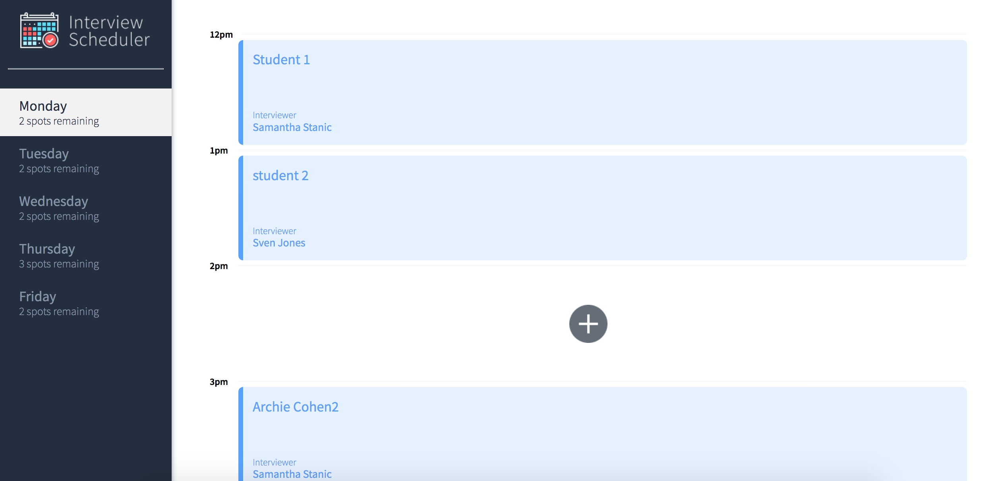
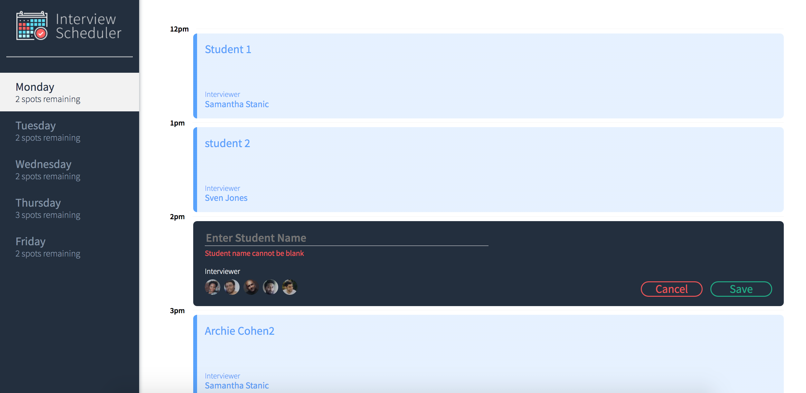
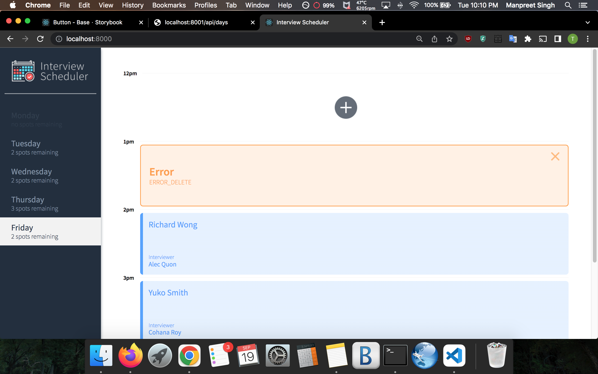

# Interview Scheduler

*Interview Scheduler* is a web application that allows users to schedule and manage interview appointments. It's built with [React](https://reactjs.org/) on the front-end and [Node.js](https://nodejs.org/) with [Express](https://expressjs.com/) on the back-end.

## Features

- Schedule appointments with specific interviewers.
- View, edit, and delete existing appointments.
- Choose from a list of available interviewers.
- Real-time updates and notifications.
- Easy-to-use and intuitive user interface.


## Setup
These instructions will help you set up the project on your local machine for development and testing purposes.

### Prerequisites
- [Node.js](https://nodejs.org/) and [npm](https://www.npmjs.com/) installed on your machine.
- Install dependencies with `npm install`.

## Built With

- React - Front-end framework.
- Node.js - JavaScript runtime.
- Express - Web application framework for Node.js.
- PostgreSQL - Database system.
- Axios - Promise-based HTTP Client

## Usage
- Sign in or create an account.
- Select a day to view available interview slots.
- Click on an available slot to create an appointment.
- Choose an interviewer from the list.
- Save your appointment.
- Edit or delete appointments as needed.

## Running Jest Test Framework

```sh
npm test
```

## Running Storybook Visual Testbed

```sh
npm run storybook
```

## Sample Screenshots

### Home Page

### Creating Appointments with Student Name Empty

### Selecting Interviewers

### Saving Appointments

### Deleting Appointment Confirmation

### Deleting Appointments

### Appointments for Monday completely booked

### Selecting different days

### Errors


